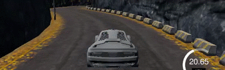
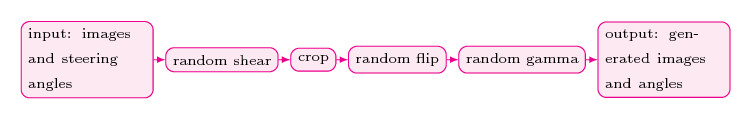
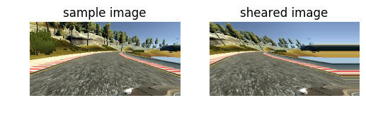
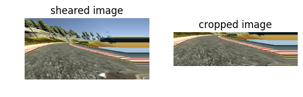
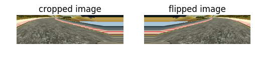
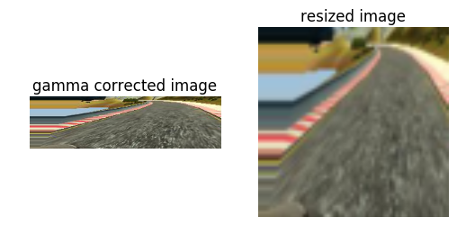
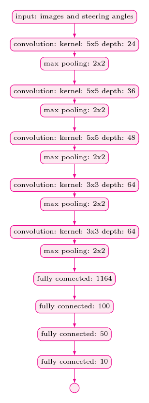

# Self-Driving Car 
## Deep Learning
### Behavioral Cloning: Navigating a Car in a Simulator

### Overview

The objective of this project is to clone human driving behavior using a Deep Neural Network (DNN). To achieve this, we use a simple Car Simulator. During the training phase, we navigate the car inside the simulator using the keyboard. While navigating, the simulator records training images and respective steering angles. These recorded data are then used to train the neural network. The trained model is tested on two tracks: the training track and the validation track. The animations below show the performance of the final model on both tracks.

#### Training | Validation
------------|---------------
 | 

### Dependencies

This project requires **Python 3.5** and the following Python libraries:

- [Keras](https://keras.io/)
- [NumPy](http://www.numpy.org/)
- [SciPy](https://www.scipy.org/)
- [TensorFlow](http://tensorflow.org)
- [Pandas](http://pandas.pydata.org/)
- [OpenCV](http://opencv.org/)
- [Matplotlib](http://matplotlib.org/) (Optional)
- [Jupyter](http://jupyter.org/) (Optional)

Install [OpenCV](http://opencv.org/) using the following command:

```bash
conda install -c https://conda.anaconda.org/menpo opencv3
```

### How to Run the Model

This repository includes a trained model which you can directly test using the following command:

```bash
python drive.py model.json
```

## Implementation

### Data Capturing

During training, the simulator captures data at a frequency of 10Hz, recording three images at each timestep from the left, center, and right cameras. Below is an example of the captured images:

#### Left | Center | Right
----|--------|-------
 |  | 

The collected data are processed before being fed into the neural network, as described in the following sections.

### Dataset Statistics

The dataset consists of 24,108 images (8,036 images per camera angle). The training track contains many shallow turns and straight road segments, resulting in a majority of recorded steering angles being zeros. Therefore, preprocessing the images and respective steering angles is necessary to generalize the training model for unseen tracks such as the validation track.

### Data Processing Pipeline

The following figure illustrates our data preprocessing pipeline:

<p align="center">
 
</p>

#### Random Shear

In the first stage, we apply a random shear operation to 90% of the images. This process helps the car navigate the training track. Below is an example of a sheared image:

<p align="center">
 
</p>

#### Cropping

We remove 35% of the original image from the top and 10% from the bottom to eliminate unnecessary details, reducing processing power requirements. Below is an example of a cropped image:

<p align="center">
 
</p>

#### Random Flip

To increase the generalization of our model, we randomly flip images (with a 0.5 probability) to balance left and right turns. Below is an example of a flipped image:

<p align="center">
 
</p>

#### Resizing

Finally, we resize images to 64x64 to reduce training time. Below is an example of a resized image:

<p align="center">
 
</p>

### Network Architecture 

Our convolutional neural network (CNN) architecture was inspired by NVIDIA's "End to End Learning for Self-Driving Cars" paper. Our model includes MaxPooling layers after each Convolutional Layer to reduce training time. The network architecture is shown below:

<p align="center">
 
</p>

### Training

Due to the large size of the dataset, we used the `fit_generator` API from Keras to train our model. We created two generators:

- `train_gen = helper.generate_next_batch()`
- `validation_gen = helper.generate_next_batch()`

Both generators use a batch size of 64. We used 20,032 images per training epoch and 6,400 images for validation. The `Adam` optimizer with a learning rate of `1e-4` was used. The model was trained for 8 epochs, which worked well on both the training and validation tracks.

## Results

Initially, I used a dataset I generated myself, but the model built from it was not sufficient for autonomous navigation. Later, I used the Udacity-published dataset, which, combined with data augmentation, resulted in a model that performed well on both tracks.

#### Training Track
[](https://www.youtube.com/watch?v=nSKA_SbiXYI)

#### Validation Track
[](https://www.youtube.com/watch?v=ufoyhOf5RFw)

## Conclusions and Future Directions

This project focused on a regression problem in the context of self-driving cars. Initially, MSE was used as the performance metric, but it proved insufficient. Switching to the Udacity dataset and incorporating data augmentation resulted in a well-performing model.

### Future Directions

- Train a model in real road conditions using a new simulator.
- Experiment with other data augmentation techniques.
- Explore Recurrent Neural Network (RNN) models such as LSTM and GRU.
- Train a deep reinforcement learning agent for autonomous navigation.
